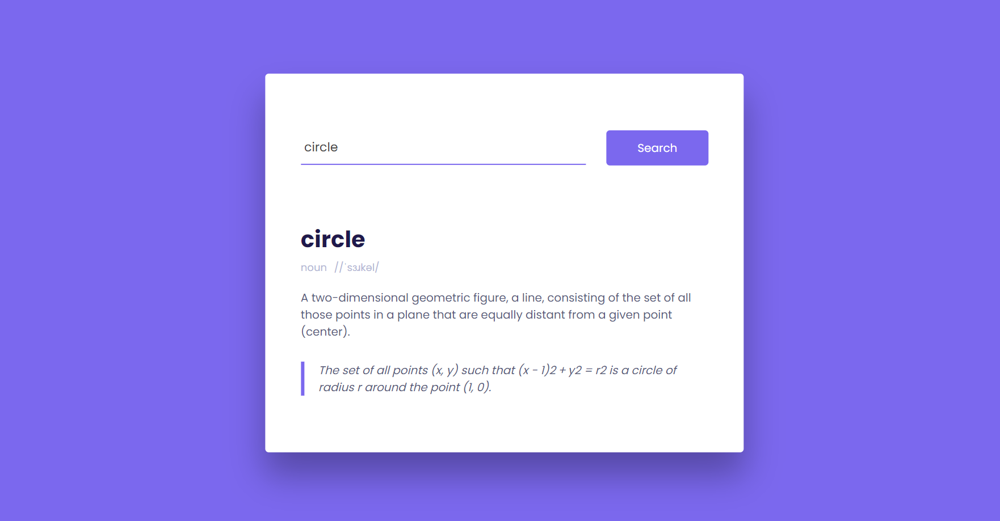

# Modern Dictionary App

Welcome to the Modern Dictionary App repository! This project is a JavaScript-based web application that leverages an API to provide users with word definitions. Built with HTML, CSS, and JavaScript, the app features a modern UI design for a visually appealing and user-friendly experience.

## Preview



## Features

- **Word Definitions:** Retrieve detailed definitions for entered words.
- **API Integration:** Utilize an external API to fetch accurate and up-to-date word information.
- **Modern UI Design:** Sleek and responsive layout for an enjoyable user interface.

## Getting Started

To run the Modern Dictionary App locally, follow these steps:

1. Clone the repository to your local machine:

   ```bash
   git clone https://github.com/Devsethi3/Modern-Dictionary-App.git
   ```

2. Open the `index.html` file in your preferred web browser.

## Usage

1. Enter a word in the search bar.
2. Click the "Search" button or press "Enter" to retrieve the word's definition.
3. Explore the detailed definition and information provided.

## API Used

This project uses the [FreeDictionaryAPI](https://dictionaryapi.dev/) to fetch word definitions.

## Customization

Feel free to customize the project to suit your preferences. Modify the design, add features, or integrate additional functionalities as needed.

## Contributing

If you'd like to contribute to this project, please follow these steps:

1. Fork the repository.
2. Create a new branch for your feature or improvement.
3. Make your changes and commit them with descriptive messages.
4. Push your changes to your forked repository.
5. Open a pull request to merge your changes into the main branch.

Explore the Modern Dictionary App, enrich your vocabulary, and consider contributing to its development. Thank you for checking out the repository!